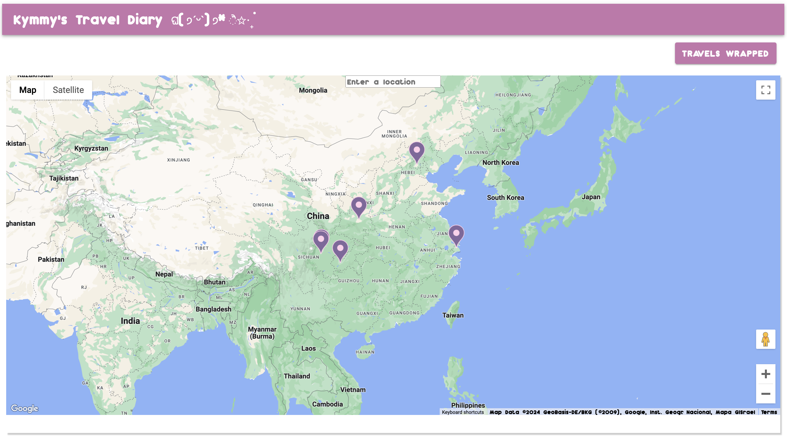

# Map-mories: Travel Diary

**Overview**

My React app is a personal travel diary designed to help users document their journeys. With the integration of the Google Maps API, users can log specific locations they've visited, add details, and upload images. The app also includes a unique "Travels Wrapped" section, offering a detailed summary of all their logged travels, displayed in both grid and table formats.

## Key Features

**Interactive Map with Color-Coded Markers**

Locations that have already been logged by the user are displayed with purple markers, distinguishing them from newly searched locations, which are marked in green. This visual distinction aids users in easily identifying places they’ve visited versus new locations they are exploring.

**Add New Travel Logs**

Users can add a new log by clicking on a marker on the map. This action opens a form where users can input details about their visit, including the location name, description, and an image. The image upload is facilitated through AWS S3, ensuring secure and efficient storage.

**Edit or Delete Existing Logs**

By clicking on an existing marker, users can either update the details of their travel log or delete it entirely. This functionality ensures that the travel diary remains up-to-date and accurate.

**Travels Wrapped Feature**

The "Travels Wrapped" feature provides a summary of all the locations logged by the user. The default view is a grid layout, but users can switch between grid and table views using a toggle button.

## Attributions & Credits

- [Google Maps API](https://developers.google.com/maps/documentation/javascript)
- [AWS S3](https://aws.amazon.com/s3/)
- [MUI](https://mui.com/)
- [Airtable](https://airtable.com/)

## Technologies Used

- Frontend: HTML, CSS, JavaScript, React
- Database: Airtable (for storing travel logs and associated data)
- APIs: Google Maps API (for map and marker functionality), AWS S3 (for image uploads)
- UI Framework: MUI (for responsive design and user interface components)

## Next Steps

- Enhance User Notifications: Style alerts to provide a more user-friendly experience
- Learn how to interact with the Google Maps API search bar